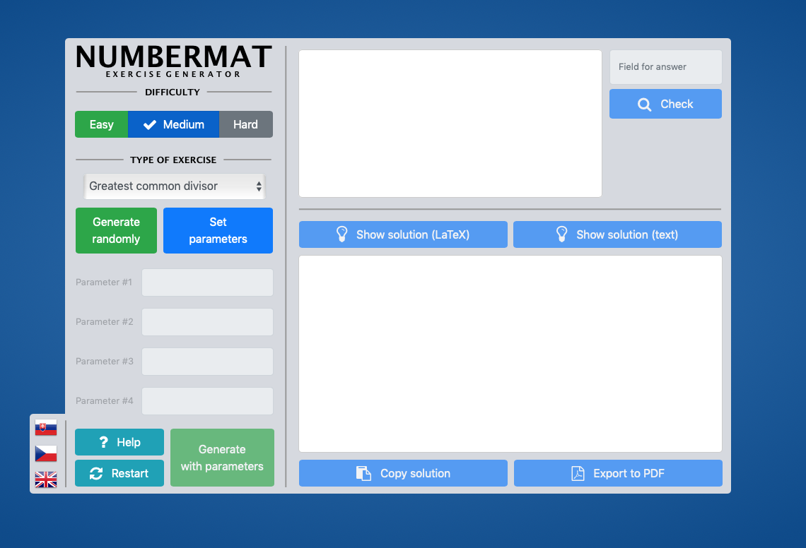
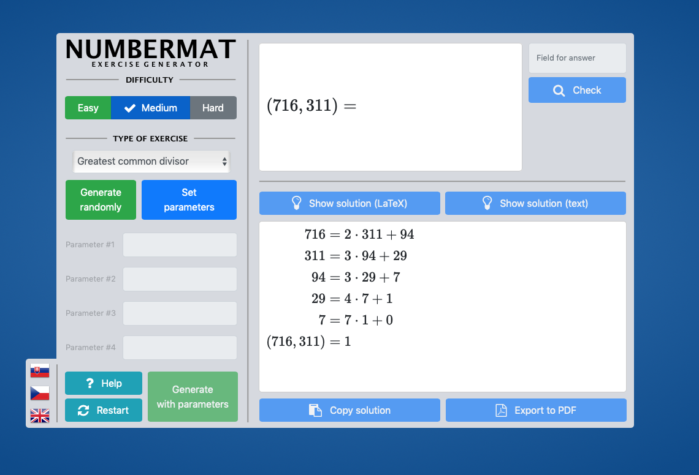
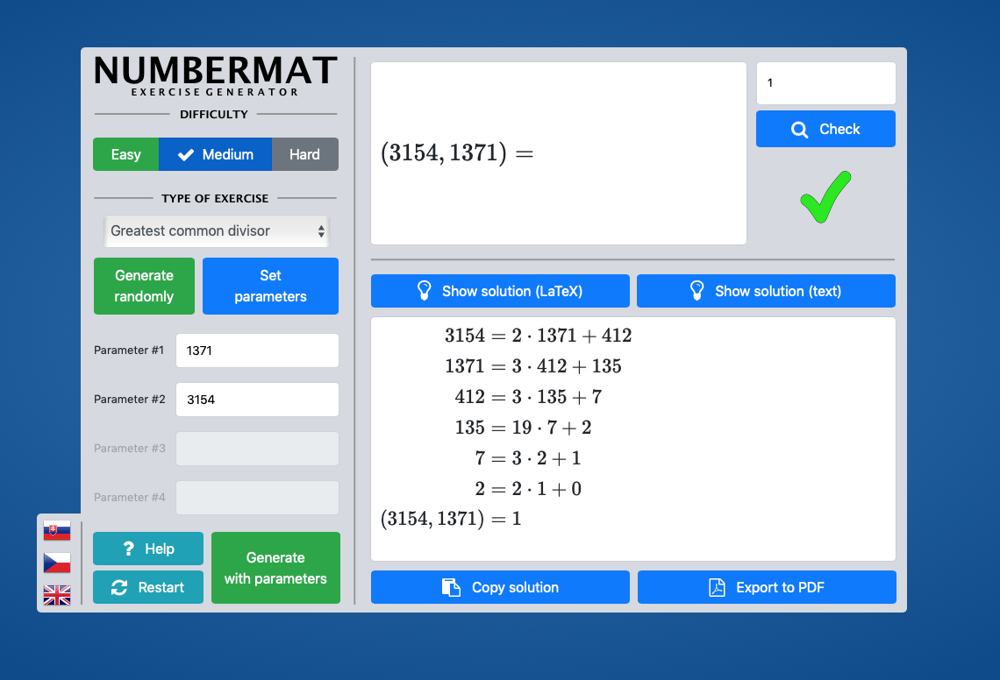

## Numbermat - Web application

The purpose of this web application is to generate math problems from number theory and algebra. This web application is based on the [original Java application Numbermat](https://github.com/svabensky/numbermat), the foundations of which were laid by [Valdemar Švábenský](https://www.fi.muni.cz/~xsvabens/index-en.html) in his bachelor's thesis in 2014.

## Usage Guide

The user can choose from 13 types of math problems. The user can choose from 3 difficulties for each type of problem, or set custom parameters. The application provides a help in the form of description of each problem and mathematical definitions. The application can also export problems and their solutions to files in PDF format. The application supports 3 languages - Slovak, Czech and English. Please report any bugs in the issues.

To use this application, you can access it via [GitHub Pages](https://maarioz.github.io/Numbermat-WebApp/#en) or you can download the ZIP of this repository, and open the index.html file in your internet browser.

Recommended browser versions (or newer): 

Chrome: 78.0 
Firefox: 70.0 
Safari: 13.0 
Opera: 64.0 
Microsoft Edge: 44

## Usage Example

